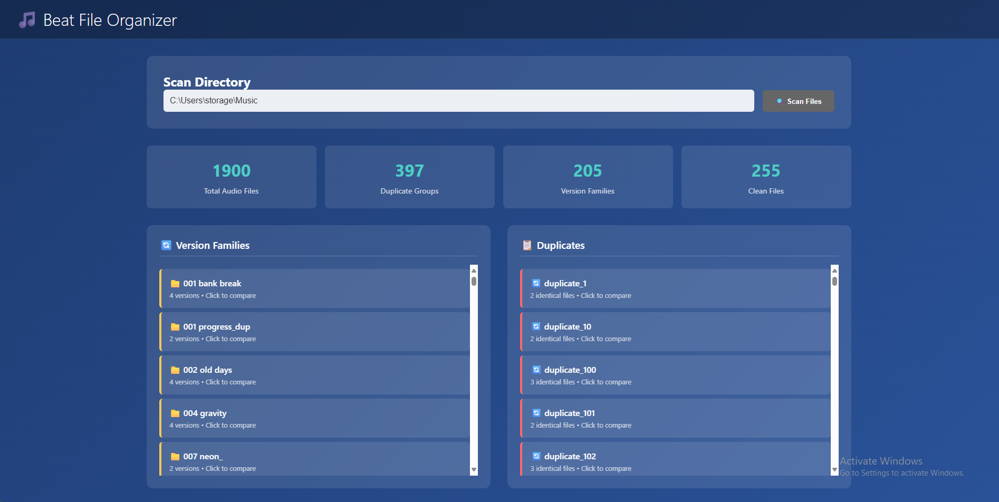
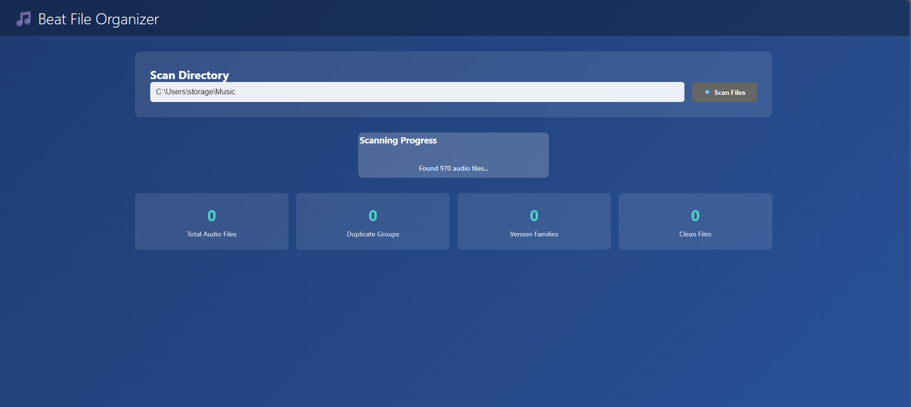

# 🎵 Beat File Organizer

> The ultimate file organizer for music producers - solve workflow chaos with audio-smart organization



## The Problem Every Producer Knows
- 1000+ beat files scattered across folders
- "beat_final_FINAL_v3_ACTUAL_FINAL.wav" naming chaos  
- Duplicates everywhere but impossible to identify safely
- No visual way to compare and organize files
- Hours wasted hunting for that one beat
- Zero insight into your actual music collection

## The Solution: Audio-First Organization

**🎛️ Visual Dashboard Features:**
- **Smart duplicate detection** - Find exact matches safely, no false positives
- **Version family detection** - Group v1, v2, v3 variations automatically  
- **Real audio waveforms** - See your beats, don't just read filenames
- **Audio preview** - Listen before you organize
- **Collection analytics** - Know what you actually have
- **Safe organization** - Preview changes before applying them

**🔊 Producer-Focused Design:**
- Understands music file workflows
- Built for beat makers, not general file management
- Audio analysis using FFmpeg (real waveforms, not fake visualizations)
- Never auto-deletes - you stay in control

## 🚀 Quick Start

### Installation
```bash
# Clone the repository
git clone https://github.com/yourusername/beat-file-organizer
cd beat-file-organizer

# Install dependencies  
pip install -r requirements.txt

# Start the web interface
python beat_organizer_gui.py
```

### Usage
1. **Open your browser** to http://localhost:5000
2. **Enter your music directory** path (e.g., `C:\Users\username\Music`)  
3. **Click "Scan Files"** and watch the magic happen
4. **Review results** - see duplicates, version families, and file analytics
5. **Preview and organize** - listen to files and organize with confidence



*The dashboard shows real-time scanning progress and comprehensive analytics*

## ✨ What Makes This Different

### 🎵 **Audio-First Approach**
- **Real waveform visualization** using FFmpeg (not fake graphics)
- **Audio preview** - click to listen before organizing
- **Producer workflow understanding** - knows about stems, versions, and beat patterns
- **Music-focused analytics** - see your collection like a producer, not a file manager

### 🛡️ **Safety First** 
- **Never auto-deletes** - you review every decision
- **Preview mode** - see exactly what will happen before applying changes
- **Conservative duplicate detection** - no false positives that could lose your work
- **Undo functionality** - track all operations (coming soon)

### 🚀 **Performance & Scale**
- **Handles massive collections** - tested with 1000+ files
- **Real-time progress** - watch your scan happen live
- **Efficient audio analysis** - FFmpeg integration for professional results
- **Background processing** - UI stays responsive during long operations

## 🏗️ Technical Stack

- **Backend**: Python Flask - lightweight and fast
- **Audio Processing**: FFmpeg integration for professional audio analysis  
- **Frontend**: Modern HTML5/JavaScript with real-time updates
- **File Handling**: Optimized for large music collections
- **Cross-Platform**: Works on Windows, Mac, and Linux

## 🎯 Roadmap

### ✅ **Current Features**
- Web-based dashboard interface
- Real-time scanning with progress tracking
- Duplicate and version family detection
- Audio waveform visualization
- File preview and comparison

### 🔮 **Coming Soon**
- **BPM detection** - automatic tempo analysis
- **Key detection** - musical key identification for DJ workflows  
- **File organization engine** - actually move and organize files
- **Batch operations** - organize multiple files at once
- **Advanced audio analysis** - loudness, quality metrics, and more

*See [IDEAS.md](IDEAS.md) for the complete feature roadmap*

---

## 🤝 Contributing

This is an open-source project built for the producer community. Contributions welcome!

## 📄 License

MIT License - use it, modify it, share it!

---

**Built by producers, for producers.** 🎵
